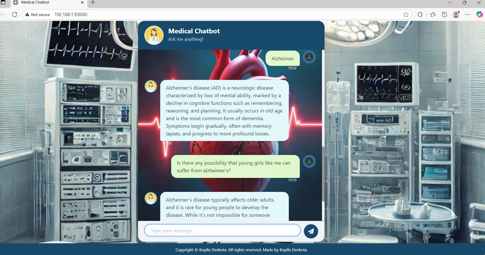

🩺 Medical Chatbot: RAG-Powered Health Assistant

Project Overview

The Medical Chatbot is an advanced Retrieval-Augmented Generation (RAG) application designed to deliver context-aware and highly accurate answers to specialized medical queries. It leverages a self-hosted vector database (Pinecone) for efficient knowledge retrieval, an external Large Language Model (Groq's Llama-3.1) for rapid inference, and a custom-designed, formal medical user interface built with Flask.

This project demonstrates expertise in combining modern LLMOps principles (vector storage, prompt engineering) with full-stack development.

Key Technical Highlights ✨

RAG Architecture: Implements a robust RAG pipeline using LangChain to ground the LLM's responses in specialized PDF documents.

Vector Database: Utilizes Pinecone Serverless for storing and indexing text chunks, enabling fast and scalable semantic search.

LLM Integration: Integrates the high-speed Groq API (using llama-3.1-70b-versatile) for extremely low-latency response generation.

Custom UI: A formal, medical-themed UI (as shown in the provided images) ensures a professional and trustworthy user experience.

🛠️ Tech Stack & Dependencies

The project is built using Python, running on Python 3.13.5  with the following key libraries:

Backend Framework :	Flask (Python)	Routing and serving the web interface.

LLM Inference :	Groq (llama-3.1-70b-versatile)	High-speed answer generation.

Vector DB : Pinecone (Serverless)	Scalable storage for vector embeddings.

Orchestration :	LangChain	Managing the RAG pipeline (retrievers, chains, prompts).

Embeddings : HuggingFaceEmbeddings (all-MiniLM-L6-v2)	Generating vector representations of text.

Data Handling : pypdf, DirectoryLoader, RecursiveCharacterTextSplitter	Loading and processing specialized PDF documents.

Styling	 : Custom CSS3, Bootstrap	Implementing the thematic UI and responsiveness.

Dependencies are listed in requirements.txt

📂 Project Structure
The codebase follows a modular structure for clarity and maintainability:

MEDICALCHATBOTWITH-LLMS-LANGCHAIN-PINECONE-FLASK-AWS/
├── data/
│   └── Medical book.pdf           # Source PDF document for RAG knowledge base.
├── src/
│   ├── __init__.py
│   ├── helper.py                  # Functions for PDF loading, splitting, and embedding.
│   ├── prompt.py                  # Defines the custom 'system_prompt' for the LLM.
├── static/
│   ├── heart.jpeg
│   ├── hospital.jpeg
│   └── style.css                  # Custom styling for the medical-themed UI.
├── templates/
│   └── chat.html                  # Main UI template.
├── .env                           # Stores confidential API keys (Pinecone, Groq).
├── app.py                         # Flask application and RAG inference endpoint.
├── store_index.py                 # Script to build and populate the Pinecone index.
└── requirements.txt

🚀 Setup and Installation Guide

1. Prerequisites

Python 3.13.5 installed.

A Groq API Key and a Pinecone API Key.

Familiarity with environment variables.

2. Environment Setup

Clone the repository:

Create and activate the virtual environment:

   python3.13 -m venv venv

   source venv/bin/activate 

Install dependencies:

   pip install -r requirements.txt

3. API Key Configuration

Create a file named .env in the root directory and populate it with your confidential keys:

# .env file

PINECONE_API_KEY="YOUR_PINECONE_API_KEY_HERE"

GROQ_API_KEY="YOUR_GROQ_API_KEY_HERE"

4. Vector Database Setup (Pinecone)

The project requires the knowledge base documents (data/*.pdf) to be processed and stored in a Pinecone index before the chatbot can run.

Run the indexing script:

   python store_index.py

Procedure: The script uses helper.load_pdf_files() to load data, text_split() to chunk content (size 500, overlap 200), and download_hugging_face_embeddings() (all-MiniLM-L6-v2, dim 384) to generate embeddings.

Pinecone: It checks for the existence of the index medical-chatbot. If missing, it creates a ServerlessSpec index in aws / us-east-1 with cosine metric and dimension 384. Finally, it populates this index using PineconeVectorStore.from_documents.

5. Running the Chatbot

Start the Flask application:

    python app.py

The app.py script initializes the ChatGroq model and builds the RAG chain (create_retrieval_chain + create_stuff_documents_chain) using the existing Pinecone index.

Access the application: Open your web browser and navigate to: http://0.0.0.0:8080

⚙️ Core Logic Explanation

helper.py:
This file contains the foundational data processing logic:

Function	Description:

load_pdf_files(data)	Uses DirectoryLoader and PyPDFLoader to load all PDF files from the specified data directory.

filter_to_minimal_docs(docs)	Filters out documents with empty page content and standardizes metadata.

text_split(minimal_docs)	Splits documents into smaller, overlapping chunks using RecursiveCharacterTextSplitter (chunk_size=500, chunk_overlap=200).

download_hugging_face_embeddings()	Downloads and loads the sentence-transformers/all-MiniLM-L6-v2 model for embedding generation.
app.py (RAG Chain Construction)

The main application constructs the RAG pipeline:

Embedding & Retrieval:

embeddings = download_hugging_face_embeddings()

docsearch = PineconeVectorStore.from_existing_index(index_name="medical-chatbot", embedding=embeddings)

retriever = docsearch.as_retriever(search_type="similarity", search_kwargs={"k":3}) (Retrieves the top 3 most relevant documents).

Generation:

chatModel = ChatGroq(model_name="llama-3.1-70b-versatile") (Initializes the high-speed LLM).

The prompt is constructed using system_prompt from src/prompt.py to instruct the LLM on its role as a medical assistant.

Chain:

The retrieval chain (rag_chain) combines the retrieved context with the user's input before passing it to the Groq model for the final answer.

Output: 

